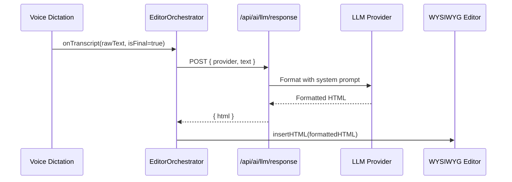

# LLM API Architecture + Auto-Format Dictation in WYSIWYG Editor

The dictated text from the voice panel needs to be auto-formatted by an LLM before being inserted into the WYSIWYG editor. A modular API backend under `app/api/ai/llm/` will support **7 LLM providers** with a unified response endpoint.

## User Review Required

> [!IMPORTANT]
> **API Keys needed in `.env`** — You'll need to add keys for whichever providers you want to use. I'll create the `.env` template. At minimum, one provider must be configured for auto-formatting to work.

> [!IMPORTANT]
> **Provider selection** — The frontend will let you pick which LLM provider to use from a dropdown in the editor header. Should default to Gemini (since you have `@google/genai` installed) or do you prefer a different default?

## Proposed Changes

### Component: LLM Provider Abstraction Layer (`lib/ai/`)

A shared types file and per-provider adapter so every LLM speaks the same interface.

#### [NEW] [types.ts](file:///Users/ajitkumarpandit/Desktop/advocatehub/draft.advocatehub.org/lib/ai/types.ts)
- Shared `LLMProvider`, `LLMRequest`, `LLMResponse` types
- `FormatDictationRequest` / `FormatDictationResponse` interfaces
- Provider enum: `openai | claude | gemini | openrouter | lmstudio | ollama`

#### [NEW] [providers/openai.ts](file:///Users/ajitkumarpandit/Desktop/advocatehub/draft.advocatehub.org/lib/ai/providers/openai.ts)
- Uses already-installed `openai` SDK (`^6.33.0`)
- Calls `chat.completions.create` with the formatting system prompt

#### [NEW] [providers/claude.ts](file:///Users/ajitkumarpandit/Desktop/advocatehub/draft.advocatehub.org/lib/ai/providers/claude.ts)
- Uses already-installed `@anthropic-ai/sdk` (`^0.82.0`)
- Calls `messages.create`

#### [NEW] [providers/gemini.ts](file:///Users/ajitkumarpandit/Desktop/advocatehub/draft.advocatehub.org/lib/ai/providers/gemini.ts)
- Uses already-installed `@google/genai` (`^1.48.0`)
- Calls `generateContent`

#### [NEW] [providers/openrouter.ts](file:///Users/ajitkumarpandit/Desktop/advocatehub/draft.advocatehub.org/lib/ai/providers/openrouter.ts)
- Uses OpenAI SDK with custom base URL (`https://openrouter.ai/api/v1`)

#### [NEW] [providers/lmstudio.ts](file:///Users/ajitkumarpandit/Desktop/advocatehub/draft.advocatehub.org/lib/ai/providers/lmstudio.ts)
- Uses OpenAI SDK with local base URL (`http://localhost:1234/v1`)

#### [NEW] [providers/ollama.ts](file:///Users/ajitkumarpandit/Desktop/advocatehub/draft.advocatehub.org/lib/ai/providers/ollama.ts)
- Uses Ollama REST API (`http://localhost:11434/api/generate`)

#### [NEW] [registry.ts](file:///Users/ajitkumarpandit/Desktop/advocatehub/draft.advocatehub.org/lib/ai/registry.ts)
- Provider registry — looks up the correct adapter by provider name
- Validates env keys are present for the selected provider

#### [NEW] [prompts.ts](file:///Users/ajitkumarpandit/Desktop/advocatehub/draft.advocatehub.org/lib/ai/prompts.ts)
- System prompt for legal document formatting
- Takes raw dictated text → returns properly formatted HTML with legal structure (headings, clauses, bold keywords like WHEREAS, etc.)

---

### Component: API Route Handlers (`app/api/ai/llm/`)

Each provider gets its own route, plus a unified `/response` endpoint that routes to the correct provider.

#### [NEW] [route.ts](file:///Users/ajitkumarpandit/Desktop/advocatehub/draft.advocatehub.org/app/api/ai/llm/response/route.ts)
- **Unified entry point** — `POST /api/ai/llm/response`
- Accepts `{ provider, text, context? }`, delegates to the right provider adapter
- Returns `{ html, provider, model }` — the auto-formatted HTML

#### [NEW] [route.ts](file:///Users/ajitkumarpandit/Desktop/advocatehub/draft.advocatehub.org/app/api/ai/llm/openai/route.ts)
- Direct OpenAI endpoint — `POST /api/ai/llm/openai`

#### [NEW] [route.ts](file:///Users/ajitkumarpandit/Desktop/advocatehub/draft.advocatehub.org/app/api/ai/llm/claude/route.ts)
- Direct Claude endpoint — `POST /api/ai/llm/claude`

#### [NEW] [route.ts](file:///Users/ajitkumarpandit/Desktop/advocatehub/draft.advocatehub.org/app/api/ai/llm/gemini/route.ts)
- Direct Gemini endpoint — `POST /api/ai/llm/gemini`

#### [NEW] [route.ts](file:///Users/ajitkumarpandit/Desktop/advocatehub/draft.advocatehub.org/app/api/ai/llm/openrouter/route.ts)
- Direct OpenRouter endpoint — `POST /api/ai/llm/openrouter`

#### [NEW] [route.ts](file:///Users/ajitkumarpandit/Desktop/advocatehub/draft.advocatehub.org/app/api/ai/llm/local/lmstudio/route.ts)
- Direct LM Studio endpoint — `POST /api/ai/llm/local/lmstudio`

#### [NEW] [route.ts](file:///Users/ajitkumarpandit/Desktop/advocatehub/draft.advocatehub.org/app/api/ai/llm/local/ollama/route.ts)
- Direct Ollama endpoint — `POST /api/ai/llm/local/ollama`

---

### Component: Frontend Integration (Editor)

Wire the dictation → LLM auto-format → WYSIWYG pipeline.

#### [NEW] [useAutoFormat.ts](file:///Users/ajitkumarpandit/Desktop/advocatehub/draft.advocatehub.org/hooks/useAutoFormat.ts)
- Custom hook that debounces dictated text, sends it to `/api/ai/llm/response`, receives formatted HTML
- Manages loading/error states
- Provides `formattedHTML` to insert into WYSIWYG

#### [MODIFY] [EditorOrchestrator.tsx](file:///Users/ajitkumarpandit/Desktop/advocatehub/draft.advocatehub.org/components/Editor/EditorOrchestrator.tsx)
- Add `useAutoFormat` hook
- When voice dictation produces final text → send to LLM → insert **formatted** HTML into WYSIWYG (not raw text)
- Show a small "AI formatting..." indicator

#### [MODIFY] [WYSIWYGEditor.tsx](file:///Users/ajitkumarpandit/Desktop/advocatehub/draft.advocatehub.org/components/Editor/WYSIWYGEditor/WYSIWYGEditor.tsx)
- Add `insertHTML(html: string)` method to the ref API so formatted HTML can be injected

#### [MODIFY] [EditorHeader.tsx](file:///Users/ajitkumarpandit/Desktop/advocatehub/draft.advocatehub.org/components/Editor/EditorHeader/EditorHeader.tsx)
- Add LLM provider selector dropdown (OpenAI / Claude / Gemini / OpenRouter / LM Studio / Ollama)

#### [MODIFY] [.env](file:///Users/ajitkumarpandit/Desktop/advocatehub/draft.advocatehub.org/.env)
- Add template keys for all providers

---

## Data Flow

## Open Questions

> [!IMPORTANT]
> 1. Which LLM provider should be the **default**? (Gemini is already in dependencies)
> 2. Do you want **streaming** responses (text appears word-by-word) or **batch** (wait for full response)?
> 3. For local providers (LM Studio, Ollama) — which model names should I default to? (e.g., `llama3` for Ollama, `default` for LM Studio)

## Verification Plan

### Automated Tests
- `npx next build` — ensure all route handlers compile
- Test each route handler individually with curl/fetch

### Manual Verification
- Open `/editor`, dictate text, select a provider, verify formatted HTML appears in the WYSIWYG editor
